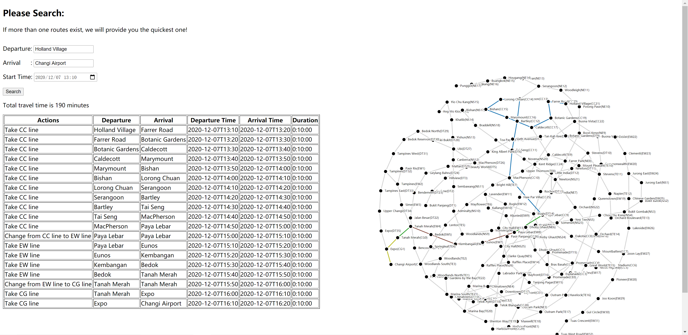

# MRT Search System

## Purpose
A generic solution to find the best MRT travel plan!

## A Real Example


## How to build
### Requirements
  * This is a Python 3.9.0 project.

### Build
This is a standard Python project. You can easily build it by standard Python Packaging command.

1. Install ```pip install twine~=3.2.0```. This is a Collection of utilities for publishing packages on PyPI. See more [twine home page](https://pypi.org/project/twine/).
1. Go to the root dir of this project.
1. Run command ```python setup.py sdist bdist_wheel```.
1. Then, you will get the python package under ```dist``` folder, named ```mrt-<version>-py3-none-any.whl```.

## How to Deploy
You can run this project as a simple local server, or run as a docker container.

### Local Deploy
1. Simply install the built package using ```pip install mrt-<version_number>-py3-none-any.whl```.
2. Run command ```mrt``` to start the web service.

### Docker Deploy
1. Build docker image by the ```Dockerfile``` in project root dir.
1. Simply start the docker container by the docker image. The service is automatically triggered when the container starts.

## How to use
* Open the web page```http://<host>:5000/``` using your favourite browser.
* Simply type in the ```Departure```, ```Arrival``` and ```Start Time```, then click ```Search```! 
  The result will be just in front of you!
 
## Test
### Unit & Backend Test
Based on ```tox```. Steps to run:
1. Go to the root dir of the project.
1. Install requirement ```pip install -r test/unit/requirements.txt```
1. Run test by command ```tox```

### Code Coverage
Code coverage report is automatically created when running command ```tox```.
You will find by opening ```htmlcov/index.html```.

The current (version 0.1.0) code coverage is 96%.

### Frontend Test
Based on Selenium. Steps to run:
1. Install the test browser on your host machine.
1. Download corresponding Selenium browser driver and save in ```test/frontend/drivers```. See more details in [Selenium Doc](https://www.selenium.dev/documentation/en/webdriver/driver_requirements/)
1. Go to the root dir of the project
1. Install requirement ```pip install -r test/frontend/requirements.txt```
1. Run test by command ```py.test test/frontend```
  
### Performance Test
* TODO
