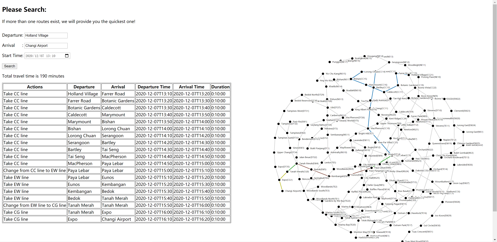

# MRT Search System

## Purpose
This project provides a generic solution to find the best MRT travel plan!

## An Example


## System Requirements
This projected is built and tested under ```Python 3.9.0```, 
using [Flask](https://flask.palletsprojects.com/)

Make sure ```Python 3.9.0``` has been installed in your operating system.
Please refer to [this link](https://www.python.org/) for Python installation.
Also make sure ```pip``` has been installed.

## How to build

This is a standard Python project. You can easily build it by standard Python Packaging command.

1. Install twine by command ```pip install twine~=3.2.0```. This is a Collection of utilities for publishing packages on PyPI. See more [twine home page](https://pypi.org/project/twine/).
1. Go to the root directory of this project.
1. Run command ```python setup.py sdist bdist_wheel```.
1. Then, you will get the python package under ```dist``` folder, named ```mrt-<version>-py3-none-any.whl```.

## How to Deploy
You can run this project as a simple local server, or run as a docker container.

### Deploy locally
1. Install the built package by command ```pip install mrt-<version_number>-py3-none-any.whl```.
2. Run command ```mrt``` to start the web service.

### Deploy using Docker
1. Go to the root directory of this project.
1. Build docker image by command ```docker image build -t mrt:<version_number> .```. 
   This will use the ```Dockerfile``` in project root directory.
1. Start the docker container by command ```docker run -itd mrt:<version_number>```. 
   The docker image is what you have just built. 
   The service is automatically triggered when the container starts.

## How to use
* Open the web page```http://<host>:5000/``` using your favourite browser.
* Type in the ```Departure Station Name```, ```Arrival Station Name``` and ```Start Time```, then click ```Search```! 
  The result will be just in front of you!
 
## Test
### Unit & Backend Test
Unit & Backend Test is based on ```tox```. Steps to run:
1. Go to the root directory of the project.
1. Install requirements by command ```pip install -r test/unit/requirements.txt```.
1. Run test by command ```tox```.

#### Code Coverage
Code coverage report is automatically generated after you run the Unit & Backend Test.
You can get the report by opening ```htmlcov/index.html```.

The code coverage of current version (0.1.0) is 96%.

### Frontend Test
Frontend Test is based on ```Selenium```. Steps to run:
1. Install the test browser on your host machine.
1. Download corresponding Selenium browser driver and save in ```test/frontend/drivers```. 
   See more details in [Selenium Doc](https://www.selenium.dev/documentation/en/webdriver/driver_requirements/)
1. Go to the root directory of the project
1. Install requirements by command ```pip install -r test/frontend/requirements.txt```
1. Run test by command ```py.test test/frontend```
  
### Performance Test
* TODO
